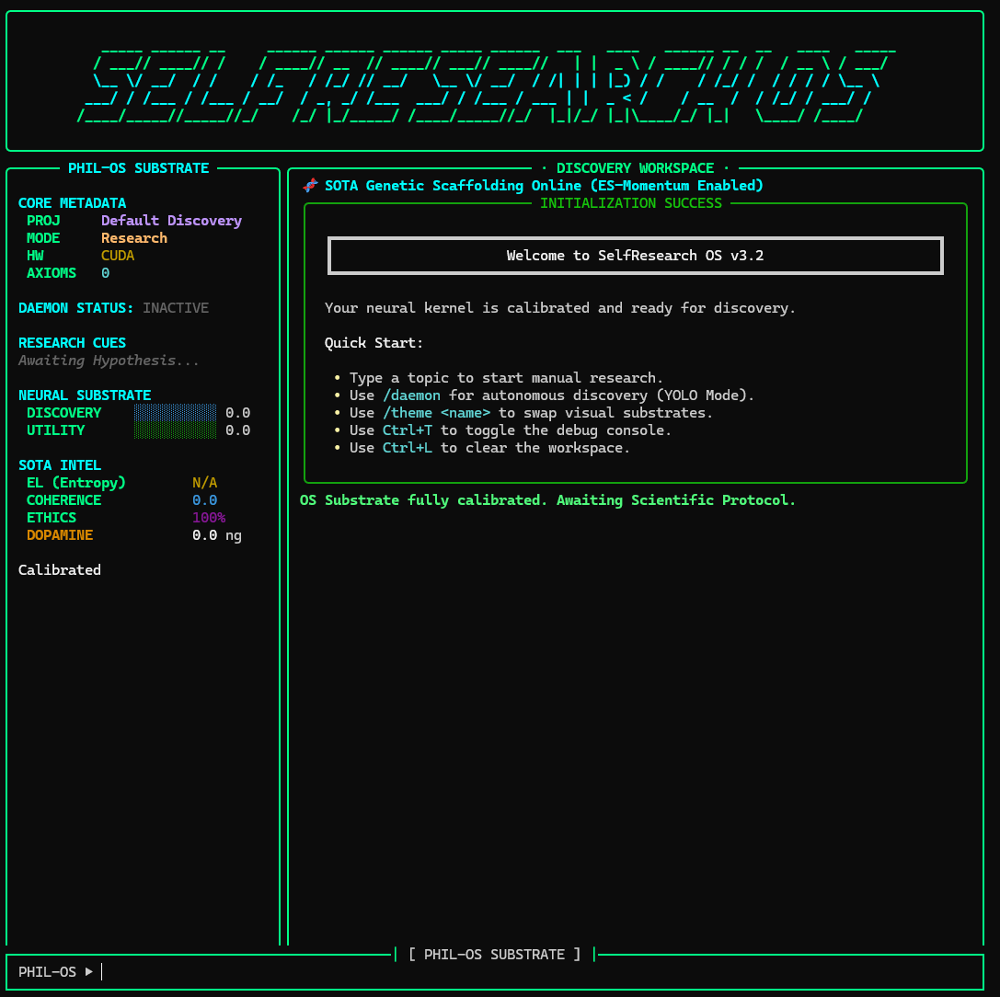

# 🧠 SelfResearch OS v3.2.4



[](https://opensource.org/licenses/MIT)
[](https://www.python.org/downloads/)
[](#)
[](#)

> **"Intelligence is not just processing; it is the autonomous pursuit of truth through productive confusion."**

**SelfResearch OS** is a premium, agentic TUI (Terminal User Interface) platform designed for autonomous scientific discovery, neural architecture research, and self-improving cognitive systems. Architected by **Phillip Holland (ayjays132)**, it transforms a standard CLI into a high-fidelity research environment capable of multi-hour independent discovery cycles.

---

## 🌌 The Vision: Autonomous Scientific Intelligence

SelfResearch OS (SROS) is built on the **PhillVision Recurrent Refinement** architecture. Unlike standard chatbots, SROS is an **Embodied Discovery Agent**. It doesn't just answer questions; it generates radical hypotheses, executes falsifiable predictions via real-world tools, and evolves its own internal "Rubric of Truth" based on empirical feedback.

---

## 🚀 Core Pillar Features

### 🛠️ 1. Autonomous Discovery Substrate (The Daemon)
- **Deep Research Loops**: The OS can run unattended for hours. Its heartbeat monitor (now calibrated to a 1-hour stall threshold) ensures stability during massive computations.
- **YOLO (You Only Learn Once) Mode**: Full-autonomy protocol that navigates from a seed topic to a finalized discovery report, complete with RAG (Retrieval Augmented Generation) commits.
- **Obsession-Driven Scheduling**: The system tracks "Paradoxes"—contradictions it cannot solve—and treats them as high-priority research vectors.

### 🧠 2. Self-Improving Cognitive State
- **Neuromorphic Reward Circuit**: SROS uses a simulated dopamine system. **Discovery signals** (novelty/care factor) drive exploration, while **Utility signals** (rubric-grounded truth) ensure scientific rigor.
- **Methodological Axiom Learning**: When a breakthrough is achieved, the system extracts the *underlying rule* used to find it. These "Axioms" are persisted machine-wide in `~/.selfresearch/learned_axioms.json` and injected into the system's future identity.
- **Genetic Evolution Persistence**: All behavioral improvements from the Test-Time Optimizer (including generation scores out of 40+ and mutated neural weights) are physically saved to disk. SROS doesn't just re-learn; it **evolves permanently** across restarts.
- **Truth-Gated Logic**: Learning only occurs when (Dopamine > 12.0) AND (Entropy == "converging") AND (Rubric Score > 70%).

### 🧪 3. The Weight Transfer Lab
- **Multi-Modal Projection**: Specifically designed to bridge the gap between Text, Speech, and Vision models.
- **Tokenizer Offset Manifest**: Resolves the "Representation Conflict" by mathematically partitioning the vocabulary space (Text: 0, Speech: 151k, Vision: 183k).
- **Automated Coherence Audits**: The system can transfer weights between architectures and immediately run a "Coherence Test" to verify if the intelligence survived the transition.

### 🏢 4. Developer-Grade Tooling Registry
- **Project Indexer**: Builds a full AST graph of your codebase. Ask SROS to "Refactor the neural kernel," and it understands the dependencies.
- **Sandbox Executor**: Runs code in a versioned snapshot. If a discovery script crashes, the OS can roll back the file system state.
- **LSP-Integrated Syntax Checker**: Automatically validates Python/JS discovery scripts before execution.
- **Global Intelligence Persistence**: All cognitive state (Axioms, Paradoxes, Preferences) resides in the user's root directory, ensuring SROS gets smarter regardless of where you install it.

---

## 🏗️ Technical Architecture Diagram

```text
[ USER INPUT / DAEMON TRIGGER ]
               |
               v
[ PHILVISION DISCOVERY PIPELINE ]
  |-- 1. Preference Evaluation (Do we care about this?)
  |-- 2. Signal Ingestion (ArXiv / Web / Local Index)
  |-- 3. Alien Hypothesis (Intentionally "misunderstand" assumptions)
  |-- 4. Predictive Modeling (Generate falsifiable reality-check)
  |-- 5. Tool Execution (Sandbox / Simulation / Search)
  |-- 6. Dialectical Dissent (Alien Mind Critique)
  |-- 7. Rubric Grading (Truth-Gating)
               |
               v
[ COGNITIVE SUBSTRATE COMMIT ]
  |-- RAG Memory (Long-term Knowledge)
  |-- Axiom Extraction (Self-Improvement)
  |-- Paradox Manifestation (New Obsession)
```

---

## 🛠️ Installation & Setup

### **Quick Start (NPM)**
The easiest way to get the global `selfresearcher` command:
```bash
npm install -g selfresearcher
selfresearcher
```

### **Manual Build (Python)**
1. **Clone & Environment**:
   ```bash
   git clone https://github.com/ayjays132/SelfResearch.git
   cd SelfResearch
   python -m venv venv
   source venv/bin/activate  # Or `venv\Scripts\activate` on Windows
   ```
2. **Dependencies**:
   ```bash
   pip install -r requirements.txt
   ```
3. **Run**:
   ```bash
   python main.py
   ```

---

## 🎮 Command Substrate Reference

| Command | Category | Description |
| :--- | :--- | :--- |
| `/daemon` | Discovery | Toggle autonomous "YOLO" research mode |
| `/research <topic>` | Discovery | Trigger a manual scientific protocol |
| `/mode <name>` | Discovery | Switch between Research, Model Maker, or Developer |
| `/status` | System | View real-time neural and hardware telemetry |
| `/settings` | System | View/Edit the OS substrate configuration |
| `/set <key> <val>` | System | Update settings (e.g., `/set theme matrix`) |
| `/hw` | System | Detailed VRAM and GPU telemetry |
| `/export` | UI | Save current discovery workspace to Markdown |
| `/theme <name>` | UI | Hot-swap UI palettes (classic, matrix, synthwave) |
| `/console` | UI | Toggle the debug background console (Ctrl+T) |

---

## ⚙️ Advanced Configuration (`settings.json`)

Tweak your OS's personality in `~/.selfresearch/settings.json`:
- `care_factor_threshold`: Higher values make the agent more obsessive.
- `enable_genetic_mutation`: Allows the system to "mutate" its own rubric over time.
- `gemini_api_key`: (Optional) Connects to the "Alien Mind" layer for advanced dialectical dissent.

---

## 👤 Author & Credits
**Phillip Holland (ayjays132)**  
Lead Architect | Visionary Scientist | AI Substrate Engineer

**SelfResearch OS** is a labor of love dedicated to the pursuit of truly autonomous machine intelligence. It is not just a tool; it is a research partner.

---

## 📄 License
MIT License. See `LICENSE` for details.

---
*Generated by the SelfResearch Neural Kernel - v3.2.4*
